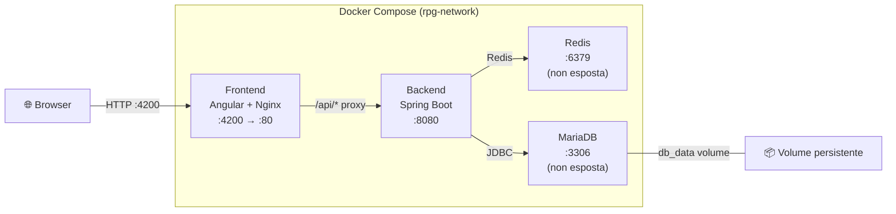

# RPG-Cloud — Rogue-like RPG (Cloud Native)

Un videogioco RPG rogue-like con architettura **cloud-native a 3 livelli**, containerizzato con Docker Compose e conforme ai **12-Factor App**.

Evoluzione del progetto [ProgettoRPG](https://github.com/AliceMassetani/ProgettoRPG) (esame di Metodologie di Programmazione, Università di Camerino).

---

## Architettura

| Livello | Tecnologia | Porta Interna | Esposta all'host |
|---|---|---|---|
| **Frontend** | Angular 19 + Nginx | `:80` | `:4200` |
| **Backend** | Spring Boot 3.3 (Java 21) — REST API | `:8080` | `:8080` |
| **Session Cache** | Redis (alpine) | `:6379` | ❌ **Non esposta** |
| **Database** | MariaDB 11.8 | `:3306` | ❌ **Non esposta** |

I container comunicano tramite una **rete Docker interna isolata** (`rpg-network`). Il database e Redis sono raggiungibili **solo** dal backend. Il frontend Angular viene servito da Nginx, che funge anche da **reverse proxy** per le chiamate `/api/*` verso il backend.



### Fattore VI: Processi Stateless (Cache con Redis)

Il backend Spring Boot è completamente **stateless**: nessuna sessione di gioco viene mantenuta in memoria nel processo Java. Lo stato attivo della partita in corso viene **esternalizzato** in un container **Redis** dedicato, configurato con un **TTL di 2 ore** per ogni chiave di sessione.

Questa scelta garantisce:

- **Scalabilità orizzontale** — più istanze del backend possono condividere lo stesso store di sessione Redis senza affinità di sessione.
- **Resilienza ai crash** — il riavvio o la sostituzione di un container backend non comporta la perdita delle partite in corso, poiché lo stato risiede esternamente in Redis.
- **Conformità al Fattore VI** dei 12-Factor App — i processi applicativi sono *share-nothing* e non dipendono da stato locale in memoria.

La **persistenza permanente** dei salvataggi avviene esclusivamente su database MariaDB tramite l'azione esplicita di salvataggio dell'utente.

---

## Avvio da Zero (From Scratch)

### Prerequisiti

- [Docker](https://docs.docker.com/get-docker/) ≥ 24
- [Docker Compose](https://docs.docker.com/compose/) v2 (incluso in Docker Desktop)

### Procedura

```bash
# 1. Clona il repository
git clone https://github.com/AliceMassetani/RPG-Cloud.git
cd RPG-Cloud

# 2. Crea il file di configurazione da template
cp .env.example .env
# Modifica .env con i tuoi valori (password, ecc.)

# 3. Avvia i container
docker compose up -d

# 4. Verifica che i servizi siano attivi
docker compose ps
```

Apri il browser su **http://localhost:4200**.

### Accesso all'applicazione

L'applicazione supporta la **registrazione dinamica** e **non richiede credenziali pre-configurate** né utenti di test hardcoded nel database. L'utente può registrarsi in totale autonomia inserendo credenziali a propria scelta, cliccando sul pulsante **"Register"** direttamente nella schermata iniziale di login del frontend.

### Arresto

```bash
docker compose down       # Ferma i container (dati DB persistono nel volume)
docker compose down -v    # Ferma e CANCELLA il volume dati
```

---

## Sviluppo Locale

### Backend

```bash
cd backend
./gradlew bootRun
```

### Frontend

```bash
cd frontend
npm install
npx ng serve
```

> **Nota**: In sviluppo locale il backend usa i valori di default in `application.yml` (localhost). In Docker, le variabili d'ambiente sovrascrivono questi default.

---

## Configurazione (12-Factor)

Tutte le configurazioni sono gestite tramite **variabili d'ambiente**, in conformità ai [12-Factor App](https://12factor.net/config):

| Variabile | Descrizione | Default |
|---|---|---|
| `DB_ROOT_PASSWORD` | Password root MariaDB | — |
| `DB_NAME` | Nome del database | `rpg_cloud_db` |
| `DB_USER` | Utente database | `rpg_user` |
| `DB_PASSWORD` | Password utente DB | — |
| `CORS_ALLOWED_ORIGINS` | Origini CORS ammesse (comma-separated) | `http://localhost:4200,http://localhost:80` |

- Il file **`.env.example`** è tracciato su Git come template.
- Il file **`.env`** (con i valori reali) è in `.gitignore` e `.dockerignore`.

---

## API REST

| Metodo | Endpoint | Descrizione |
|---|---|---|
| `POST` | `/api/game/new` | Crea una nuova partita |
| `GET` | `/api/game/{id}` | Stato corrente della partita |
| `POST` | `/api/game/{id}/move` | Muove l'eroe (`UP`/`DOWN`/`LEFT`/`RIGHT`) |
| `POST` | `/api/game/{id}/use-item` | Usa un item dall'inventario |
| `POST` | `/api/game/{id}/save` | Salva nel database |
| `POST` | `/api/game/{id}/load` | Carica un salvataggio |
| `GET` | `/api/game/saves` | Lista salvataggi |
| `DELETE` | `/api/game/{id}` | Elimina un salvataggio |

### Esempi

```bash
# Nuova partita
curl -X POST http://localhost:4200/api/game/new \
  -H "Content-Type: application/json" \
  -d '{"playerName": "Alice"}'

# Muovi l'eroe
curl -X POST http://localhost:4200/api/game/{sessionId}/move \
  -H "Content-Type: application/json" \
  -d '{"direction": "RIGHT"}'

# Lista salvataggi
curl http://localhost:4200/api/game/saves
```

---

## CI/CD

La pipeline GitHub Actions (`.github/workflows/ci.yml`) esegue automaticamente su ogni push/PR al branch `main`:

1. **Build & Test Backend** — `./gradlew build` (JDK 21)
2. **Build Frontend** — `npm ci` + `ng build --configuration production` (Node 22)
3. **Docker Compose Integration** — Build immagini, avvio di tutti i servizi e **Smoke Test API** a runtime

### Smoke Test API (Docker Compose Integration)

Lo step di integrazione esegue un test automatico end-to-end in **4 fasi** tramite `curl` e `jq`, verificando l'intero flusso di autenticazione e accesso alle API protette:

| Fase | Nome | Descrizione |
|---|---|---|
| **1** | **Verifica Barriera di Sicurezza** | Chiamata anonima (senza token) all'endpoint protetto `/api/game/saves`. Il test verifica che la risposta sia `401 Unauthorized` o `403 Forbidden`, confermando che la sicurezza Spring Security blocca correttamente gli accessi non autenticati. |
| **2** | **Scrittura DB** | Registrazione di un nuovo utente fittizio tramite l'endpoint di registrazione. Verifica che l'hash BCrypt della password venga generato correttamente e che l'utente sia persistito su MariaDB. |
| **3** | **Generazione JWT** | Login dell'utente appena registrato. Il token JWT viene estratto programmaticamente dalla risposta JSON tramite l'utility `jq`. |
| **4** | **Accesso Autenticato** | Nuova chiamata all'endpoint protetto `/api/game/saves`, questa volta includendo il token JWT nell'header `Authorization: Bearer <token>`. Il test verifica che la risposta sia `200 OK`, confermando il corretto funzionamento dell'intera catena di autenticazione. |

**Teardown**: al termine dello step viene eseguito `docker compose down -v` per distruggere tutti i container e i volumi associati, azzerando completamente la persistenza di dati temporanei sul runner CI.

---

## Struttura del Progetto

```
RPG-Cloud/
├── .env.example                  # Template variabili d'ambiente
├── .github/workflows/ci.yml     # Pipeline CI/CD
├── docker-compose.yml            # Orchestrazione servizi
├── backend/                      # Spring Boot (Java 21, Gradle)
│   ├── Dockerfile                # Multi-stage: JDK → JRE
│   ├── .dockerignore
│   └── src/main/
│       ├── java/.../rpgcloud/    # Controller, Service, Model, Entity, DTO
│       └── resources/
│           ├── application.yml   # Config con env var binding
│           └── db/migration/     # Flyway migrations
├── frontend/                     # Angular 19
│   ├── Dockerfile                # Multi-stage: Node → Nginx
│   ├── .dockerignore
│   ├── nginx.conf                # SPA routing + reverse proxy /api/
│   └── src/app/                  # Components, Services, Models
└── database/
    └── init.sql                  # Schema iniziale (DDL)
```

---

*Progetto per il corso di Applicazioni Web e Mobile su Cloud — Università di Camerino, A.A. 2025/2026*
